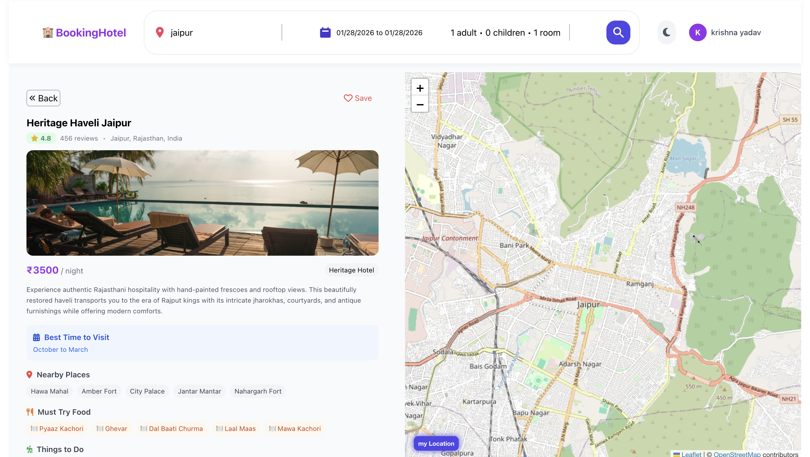

# 🏨 Hotel Booking Platform


A modern and responsive **Hotel Booking Platform** built using **React, Vite, and Tailwind CSS**.  
This project simulates a real-world hotel booking experience with authentication, map integration, bookmarking, and advanced filtering features.

---

## 🚀 Features

- 🗺️ **Interactive Map Integration**
  - View hotels on a live map
  - Filter hotels by city and location
  - Click map markers to see hotel details

- 🔐 **Firebase Authentication**
  - Secure user signup and login
  - Protected routes for authenticated users
  - Persistent authentication using Firebase

- 🏨 **Rich Hotel Listings**
  - City-wise hotel data (minimum 4 hotels per city)
  - Detailed hotel descriptions, pricing, amenities, and images

- ⭐ **Bookmark & Booking System**
  - Bookmark favorite hotels
  - Manage bookings from user dashboard

- 🌙 **Dark Mode Support**
  - Toggle between light and dark themes

- 🔍 **Advanced Search & Filters**
  - Search hotels by city
  - Filter by price range and amenities

- ⚡ **Fast & Responsive UI**
  - Powered by Vite for fast builds
  - Fully responsive design using Tailwind CSS

---

## 🛠 Tech Stack

- **Frontend**: React, Vite, Tailwind CSS
- **State Management**: React Context API
- **Backend/Data**: JSON Server (`db.json`)
- **Authentication**: Firebase Authentication
- **Map**: Custom React Map Component

---

## ▶️ How to Run Locally

1. Clone the repository:

   ```bash
   git clone https://github.com/Krishnayadav1908/hotel-booking-platform
   cd hotel-booking-platform
   ```

2. Install dependencies:

```bash
npm install
```

3. Start JSON Server for hotel data:

```bash
   npm run server
```

4. Start the frontend development server:

```bash
npm run dev
```

5. Configure Firebase:
   • Create a Firebase project
   • Enable Email/Password Authentication
   • Add your Firebase config in: src/services/firebase.js

## 📸 Screenshots

### 🏠 Home Page


### 🔍 Search Results with Map View


### 🏨 Hotel Details Page



### 🔖 Bookmark Hotels


### 🌙 Dark Mode


### 🔐 Authentication (Login / Signup)


🌟 Key Learnings
• Implemented Firebase authentication with protected routes
• Built a map-based UI for real-world location handling
• Created reusable UI components using React & Tailwind
• Managed global state using React Context API
• Worked with mock backend data using JSON Server

🤝 Contributing
Contributions are welcome!
For major changes, please open an issue first to discuss what you would like to improve.

## 📄 License

This project is licensed under the [MIT License](LICENSE).
